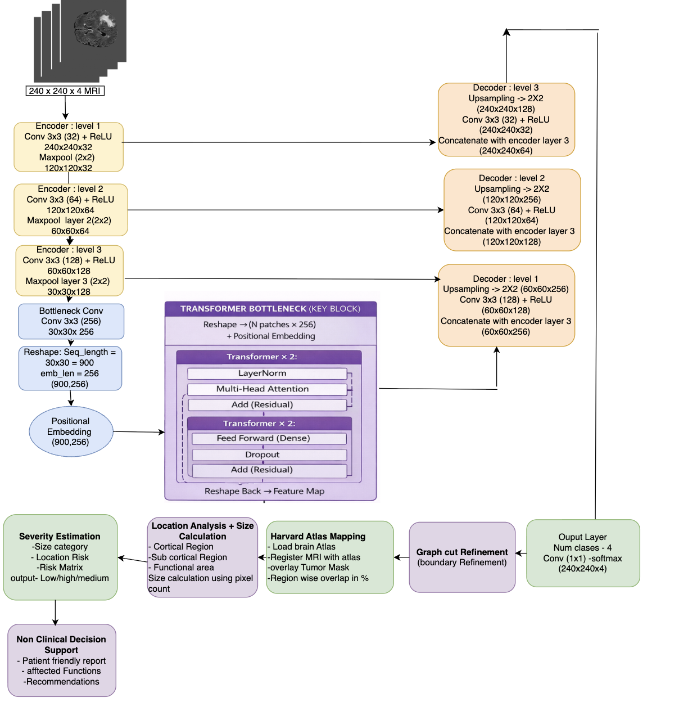

# 🧠 Brain Tumor Segmentation and Analysis System  
### Using U-Net + Transformer Bottleneck + Graph Cut Refinement + Atlas-Based Localization  

---

## Overview  
This project presents a hybrid deep learning framework for accurate brain tumor segmentation from MRI scans, combined with anatomical localization and non-clinical decision support.

The system integrates:
- U-Net for spatial feature extraction  
- Transformer (at bottleneck) for global context modeling  
- Graph Cut refinement for boundary smoothing  
- Harvard Brain Atlas mapping for tumor location identification  

Based on these outputs, the system provides non-clinical insights to assist in early understanding and prioritization.

---

## Key Features  

- Accurate brain tumor segmentation  
- Global context modeling using Transformer  
-  Graph Cut refinement for smooth boundaries  
- Atlas-based tumor localization  
- Tumor size estimation  
- Non-clinical decision support  
- Reduced noise and false positives  

---

## 💡 Novelty  

This project introduces a multi-stage intelligent pipeline that goes beyond traditional segmentation methods:

### 🔹 Hybrid U-Net + Transformer  
- Combines CNN (local features) with Transformer (global context)  
- Improves segmentation of complex tumor structures  

### 🔹 Graph Cut-Based Refinement  
- Applies energy minimization for better segmentation  
- Produces smoother and more accurate boundaries  

### 🔹 Atlas-Based Localization  
- Maps tumor to Harvard Brain Atlas  
- Identifies anatomical brain region affected  

### 🔹 Non-Clinical Decision Support  
- Provides tumor size and location insights  
- Helps in preliminary understanding (not diagnosis)  

---

## 🏗️ System Architecture  

--- 

  

## Dataset  

- BraTS 2020 Dataset  
- MRI Modalities:
  - FLAIR  
  - T1  
  - T1ce  
  - T2  

(Current implementation uses FLAIR)

---

## ⚙️ Technologies Used  

- Python  
- TensorFlow / Keras  
- NumPy  
- OpenCV  
- NiBabel / SimpleITK  
- PyMaxflow  

---

## Output  

The system generates:
- Segmented tumor mask  
- Refined mask (Graph Cut)  
- Tumor location (atlas-based)  
- Tumor size estimation  
- Non-clinical interpretation  

## Future Work  

- Multi-modal MRI integration  
- 3D tumor segmentation  
- Real-time processing  
- Clinical validation  
- Deployment as web application  

